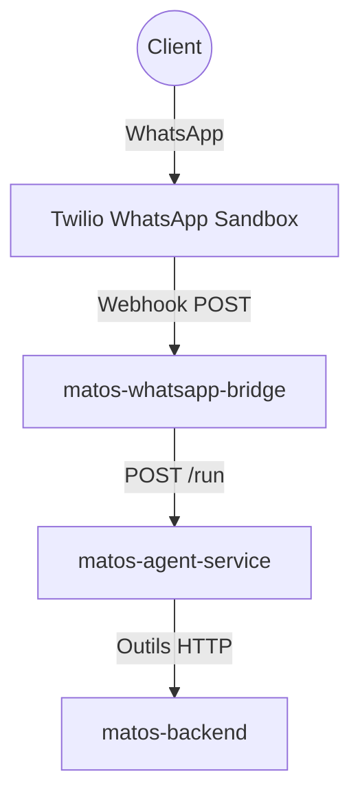

# Atelier Build with AI : Assistant WhatsApp Intelligent

## Contexte

Imaginez une petite entreprise à Bukavu qui doit répondre aux mêmes questions tous les jours sur ses produits, et parfois le propriétaire n'est pas disponible. Cet atelier vous guide pour créer un agent intelligent qui gère les interactions WhatsApp avec les clients sur WhatsApp Business. Quand un client montre un intérêt réel pour un achat, l'agent notifie le propriétaire pour finaliser la vente.

## Objectif

Construire et déployer un assistant WhatsApp de style production utilisant l'IA, avec une architecture en trois services déployés sur Google Cloud Run.

## Comment ça marche

L'assistant utilise une chaîne de services claire :

1. **matos-backend** : API pour le catalogue de produits et la gestion des clients (SQLite).
2. **matos-agent-service** : Agent LLM (Google ADK) qui appelle les outils backend pour rechercher des produits et sauvegarder des prospects.
3. **matos-whatsapp-bridge** : Pont Twilio qui reçoit les messages WhatsApp et les transmet à l'agent.

### Architecture



L'agent répond en français ou swahili selon la langue de l'utilisateur, recherche des produits, collecte les informations d'achat et notifie le propriétaire.

## Structure du projet

```
build_with_ai_workshop/
├── agents/                    # Code de l'agent IA
│   ├── requirements.txt       # Dépendances Python pour l'agent
│   ├── root_agent.py          # Agent principal avec outils TODO
│   └── data/                  # Données des produits
├── backend/                   # Pont WhatsApp Twilio
│   ├── requirements.txt       # Dépendances Python
│   ├── main.py                # Application FastAPI pour le pont
│   └── ...                    # Configuration et logger
├── matos-backend/             # Backend API des produits
│   ├── requirements.txt       # Dépendances Python
│   ├── src/
│   │   ├── main.py            # API FastAPI
│   │   ├── config.py          # Configuration Pydantic
│   │   └── data/              # Données JSON des produits
│   └── Dockerfile             # Image Docker
├── codelab/                   # Documentation de l'atelier
│   ├── docs/                  # Pages de l'atelier en français
│   ├── docusaurus.config.ts   # Configuration Docusaurus
│   └── package.json           # Dépendances Node.js
├── shared/                    # Types partagés (TypeScript)
├── data/                      # Données communes
└── README.md                  # Ce fichier
```

## Prérequis

- Compte Google Cloud avec crédits
- Compte Twilio avec sandbox WhatsApp
- Python 3.12+
- Node.js pour la documentation

## Démarrage rapide

1. **Configuration GCP** : Créer un projet, activer les APIs, ouvrir Cloud Shell.
2. **Cloner et configurer** : Variables PROJECT_ID et REGION.
3. **Déployer le backend** : API des produits sur Cloud Run.
4. **Construire l'agent** : Implémenter les outils TODO.
5. **Déployer l'agent** : Service ADK sur Cloud Run.
6. **Construire le pont** : Intégration Twilio.
7. **Déployer le pont** : Avec secrets Twilio.
8. **Tester** : Envoyer des messages WhatsApp.

Suivez les étapes détaillées dans `codelab/docs/`.

## Technologies utilisées

- **Backend** : FastAPI, Pydantic, SQLite
- **Agent** : Google ADK (LlmAgent), outils Python
- **Pont** : Twilio SDK, validation de signature
- **Déploiement** : Google Cloud Run, Cloud Build
- **Documentation** : Docusaurus
- **Langages** : Python, TypeScript

## Contribution

Cet atelier est conçu pour les apprenants. Les fichiers d'agent contiennent des blocs TODO pour guider l'implémentation.

## Licence

MIT

---

Pour plus de détails, consultez la documentation dans `codelab/docs/`.