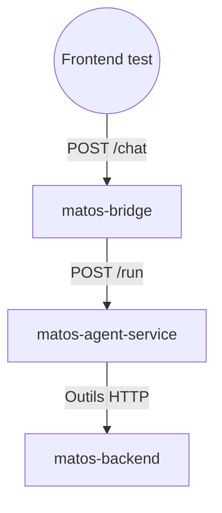

# Atelier Build with AI : Agent IA pour Webhook et Frontend

## Contexte

Imaginez une petite entreprise à Bukavu qui doit répondre aux mêmes questions tous les jours sur ses produits, et parfois le propriétaire n'est pas disponible. Cet atelier vous guide pour créer un agent intelligent qui répond aux clients via une interface web de test et un endpoint webhook/chat.

## Objectif

Construire et déployer un assistant de style production utilisant l'IA, avec une architecture en trois services déployés sur Google Cloud Run.

## Comment ça marche

L'assistant utilise une chaîne de services claire :

1. **matos-backend** : API pour le catalogue de produits et la gestion des clients (SQLite).
2. **matos-agent-service** : Agent LLM (Google ADK) qui appelle les outils backend pour rechercher des produits et sauvegarder des prospects.
3. **matos-bridge** : Service webhook/chat qui reçoit les requêtes frontend et les transmet à l'agent.

### Architecture



L'agent répond en français ou swahili selon la langue de l'utilisateur, recherche des produits et collecte les informations d'achat.

Note: vous pourrez ensuite connecter le même webhook à WhatsApp, Telegram ou une autre plateforme si besoin.

## Structure du projet

```
build_with_ai_workshop/
├── agent/                     # Code de l'agent IA
│   ├── requirements.txt       # Dépendances Python pour l'agent
│   ├── matos/root_agent.py    # Agent principal avec outils
│   └── .env                   # Variables d'environnement agent
├── backend/                   # Bridge webhook/chat
│   ├── requirements.txt       # Dépendances Python
│   ├── src/main.py            # Application FastAPI pour le bridge
│   └── ...                    # Configuration et logger
├── matos-backend/             # Backend API des produits
│   ├── requirements.txt       # Dépendances Python
│   ├── src/
│   │   ├── main.py            # API FastAPI
│   │   ├── config.py          # Configuration Pydantic
│   │   └── data/              # Données JSON des produits
│   └── Dockerfile             # Image Docker
├── codelab/                   # Documentation de l'atelier
│   ├── docs/                  # Pages de l'atelier en français
│   ├── docusaurus.config.ts   # Configuration Docusaurus
│   └── package.json           # Dépendances Node.js
├── shared/                    # Types partagés (TypeScript)
├── data/                      # Données communes
└── README.md                  # Ce fichier
```

## Prérequis

- Compte Google Cloud avec crédits
- Python 3.12+
- Node.js pour la documentation

## Démarrage rapide

1. **Configuration GCP** : Créer un projet, activer les APIs, ouvrir Cloud Shell.
2. **Cloner et configurer** : Variables PROJECT_ID et REGION.
3. **Déployer le backend** : API des produits sur Cloud Run.
4. **Construire l'agent** : Implémenter les outils TODO.
5. **Déployer l'agent** : Service ADK sur Cloud Run.
6. **Configurer le frontend** : URL du bridge webhook/chat.
7. **Tester** : Envoyer des messages via le frontend.

Suivez les étapes détaillées dans `codelab/docs/`.

## Déploiement rapide du webhook

Pour déployer le bridge webhook/chat rapidement :

```bash
cd backend
chmod +x deploy_bridge.sh
./deploy_bridge.sh
```

Le script utilise `PROJECT_ID`, `REGION` et `MATOS_AGENT_URL`, puis affiche la valeur `BRIDGE_URL` à exporter.

## Technologies utilisées

- **Backend** : FastAPI, Pydantic, SQLite
- **Agent** : Google ADK (LlmAgent), outils Python
- **Bridge** : FastAPI, endpoint `/chat`
- **Déploiement** : Google Cloud Run, Cloud Build
- **Documentation** : Docusaurus
- **Langages** : Python, TypeScript

## Contribution

Cet atelier est conçu pour les apprenants. Les fichiers d'agent contiennent des blocs TODO pour guider l'implémentation.

## Licence

MIT

---

Pour plus de détails, consultez la documentation dans `codelab/docs/`.