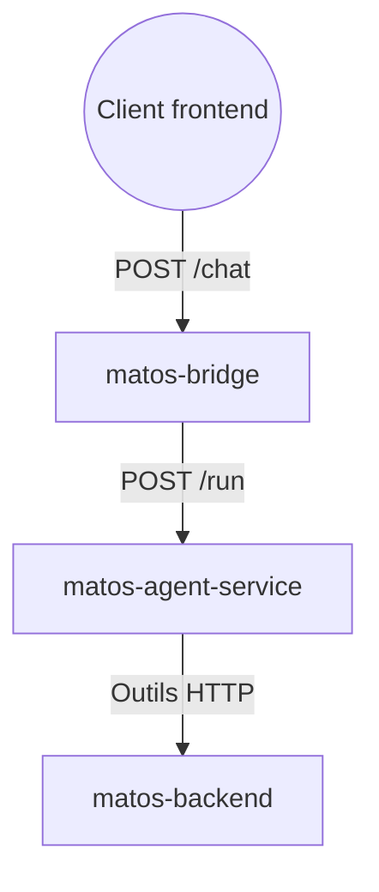

    

# Build with AI : Agent IA pour Webhook et Frontend

Bienvenue dans cet atelier. L'objectif n'est pas de construire un chatbot de démonstration, mais de livrer un agent IA utile pour un vrai cas métier.

En environ 2 heures, vous allez assembler les composants essentiels, exécuter les commandes de déploiement, et obtenir un agent de style production capable de répondre aux clients via un endpoint webhook/chat à partir de données produits réelles.

## Présentation

Cet atelier est présenté par **[Aksanti Bahiga Tacite](http://aksantibahiga.xyz/)**, Google Developer Expert Web.

Il a été facilité par **Jeremie Ndeke** et **Dorcas Bagalwa**.

- [Jeremie Ndeke](https://www.linkedin.com/in/j%C3%A9r%C3%A9mie-ndeke-museremu-sesa-70a840287/)
- [Dorcas Bagalwa](https://www.linkedin.com/in/tabitabagalwa/)

## Pourquoi cet atelier

Beaucoup de petites entreprises rencontrent les mêmes problèmes :

- les clients posent les mêmes questions toute la journée,
- les réponses arrivent tard quand l'équipe est occupée,
- les données produit existent, mais ne sont pas disponibles dans le flux de conversation.

Cet atelier montre comment résoudre cela avec une architecture simple : l'agent lit un message, appelle des outils, récupère des données réelles, répond clairement et capture l'intention d'achat.

## Chatbot vs Agent

Un chatbot traditionnel suit surtout des scénarios scriptés.

Un agent combine raisonnement et actions :

- il comprend l'intention du client,
- il appelle des APIs pour récupérer des données réelles,
- il adapte ses réponses au contexte,
- il peut déclencher des actions métier, par exemple la capture d'un prospect.

Dans cet atelier, vous construisez ce deuxième modèle : un agent qui agit, pas seulement un bot qui répète.

## Ce que vous allez construire

Vous allez déployer trois services sur Google Cloud :

1. `matos-backend`  
   API produits/clients. Source de vérité des données métier.

2. `matos-agent-service`  
   Runtime de l'agent. Comprend l'entrée utilisateur, appelle des outils et produit les réponses.

3. `matos-bridge`  
   Pont de canal. Reçoit les requêtes webhook/chat et transmet les requêtes à l'agent.

## Résultats attendus

À la fin, vous aurez :

- un agent IA déployé sur Cloud Run,
- un flux de test web fonctionnel,
- une base prête pour connecter plus tard WhatsApp, Telegram ou une autre plateforme.

Le plus important : vous comprendrez un schéma de production réutilisable pour le support, la vente et la réservation.

## Format de la session (2 heures)

- Configuration Cloud et variables d'environnement : 15 min
- Déploiement du backend : 15 min
- Construction et validation locale de l'agent : 30 min
- Déploiement de l'agent : 20 min
- Validation finale (webhook/chat + frontend) : 40 min

## Prérequis

- bases Python,
- utilisation basique du terminal,
- un projet Google Cloud,
- un navigateur web.

Vous n'avez pas besoin d'être expert DevOps pour suivre cet atelier.

## Outils utilisés

- [ADK](https://adk.dev/)
- [Google Cloud Platform (GCP)](https://cloud.google.com/)

Commencez par `00 - Variables d'environnement`, puis continuez avec `01 - Configuration`.

## Aperçu du résultat final

Voici l'interface frontend finale utilisée pour tester l'agent :

    

## Architecture utilisée dans cet atelier

### Pourquoi ce flux fonctionne

- Le bridge reste simple (transport des requêtes webhook/chat).
- La logique métier conversationnelle reste dans l'agent.
- Le backend reste réutilisable pour d'autres canaux plus tard.

## Objectifs d'apprentissage

- Déployer une architecture IA multi-services sur Cloud Run.
- Gérer des variables d'environnement réutilisables dans Cloud Shell.
- Comprendre comment un agent utilise des outils pour accéder à des données réelles.
- Tester un flux complet via frontend + endpoint webhook/chat.

Vous pourrez ensuite brancher ce webhook sur WhatsApp, Telegram ou toute autre plateforme de messagerie.

Pour lancer toute la pile en local sans GCP, allez à `09 - Exécution locale complète`.
