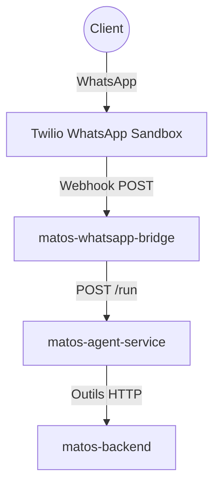

    

 Build with AI Workshop

# De l'idée au WhatsApp Sales Agent

    Bienvenue dans ce workshop Build with AI.
    Vous allez construire, déployer et exploiter un agent IA utile au business local,
    connecté à un vrai backend et à Twilio WhatsApp.

    

        <h3>Backend fiable</h3>
        
Catalogue produits, clients et API FastAPI déployés sur Cloud Run.

    

    

        <h3>Agent intelligent</h3>
        
Google ADK + outils métier pour recommander, qualifier et convertir.

    

    

        <h3>Expérience WhatsApp</h3>
        
Bridge Twilio pour des conversations opérationnelles en conditions réelles.

    

## Contexte

Imaginez que vous avez une boutique à Bukavu.

Vous avez déjà un système (site/app) qui gère les produits et les clients, mais en pratique beaucoup de clients écrivent sur WhatsApp.
Le problème est simple:

- Vous devez répondre aux mêmes questions toute la journée.
- Vous n'êtes pas toujours disponible.
- Pour vérifier le stock/prix, vous devez ouvrir le site, chercher l'information, puis revenir sur WhatsApp.

Résultat: perte de temps, charge mentale, réponses parfois lentes.

L'idée de ce codelab est de construire un agent séparé de l'application principale:

- L'agent parle avec les clients sur WhatsApp.
- L'agent utilise les endpoints backend pour lire les vraies données (produits, disponibilité, etc.).
- Quand l'agent détecte une intention d'achat, il notifie le propriétaire sur WhatsApp.

Ainsi, le propriétaire gagne du temps et se concentre sur la vente.

## C'est quoi un agent (version simple)

Un LLM seul, c'est comme un étudiant brillant qui sait beaucoup de choses mais qui n'a pas accès au terrain.

Un agent, c'est ce même étudiant à qui on donne des outils:

- un clavier,
- un ordinateur,
- et surtout des fonctions qui appellent votre backend.

Avec ces outils, il ne "devine" pas: il va chercher l'information réelle dans votre système avant de répondre.

Dans cet atelier, vous allez construire et déployer une chaîne simple et robuste:

1. Déployer `matos-backend` (catalogue + clients) et sauvegarder son URL.
2. Construire l'agent avec des TODO guidés, puis le déployer.
3. Construire le bridge WhatsApp Twilio, puis le déployer.

## Ce que vous allez construire

Vous allez déployer trois services sur Cloud Run :

- `matos-backend` : API produit et client.
- `matos-agent-service` : Agent LLM qui appelle les outils backend.
- `matos-whatsapp-bridge` : Pont webhook Twilio vers l'agent.

## Architecture utilisée dans cet atelier

### Pourquoi ce flux est recommande

- Le bridge reste simple (transport + sécurité Twilio).
- La logique métier conversationnelle reste dans l'agent.
- Le backend reste réutilisable par d'autres canaux plus tard.

## Objectifs d'apprentissage

- Déployer une architecture AI multi-services sur Cloud Run.
- Gérer des variables d'environnement réutilisables dans Cloud Shell.
- Comprendre comment un agent utilise des outils pour lire des données réelles.
- Intégrer WhatsApp Twilio avec des identifiants sécurisés.

Passez à `00 - Variables d'environnement` puis `01 - Configuration`.
