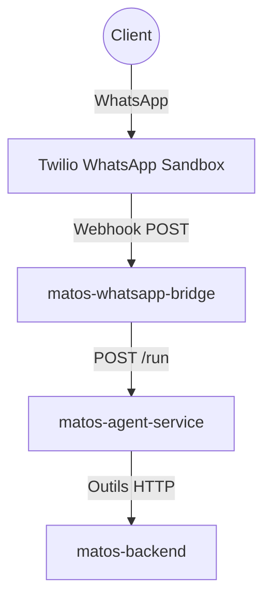

# Introduction : Construire Matos de bout en bout

## Contexte

Imaginez que vous avez une boutique a Bukavu.

Vous avez deja un systeme (site/app) qui gere les produits et les clients, mais en pratique beaucoup de clients ecrivent sur WhatsApp.
Le probleme est simple:

- Vous devez repondre aux memes questions toute la journee.
- Vous n'etes pas toujours disponible.
- Pour verifier le stock/prix, vous devez ouvrir le site, chercher l'information, puis revenir sur WhatsApp.

Resultat: perte de temps, charge mentale, reponses parfois lentes.

L'idee de ce codelab est de construire un agent separe de l'application principale:

- L'agent parle avec les clients sur WhatsApp.
- L'agent utilise les endpoints backend pour lire les vraies donnees (produits, disponibilite, etc.).
- Quand l'agent detecte une intention d'achat, il notifie le proprietaire sur WhatsApp.

Ainsi, le proprietaire gagne du temps et se concentre sur la vente.

## C'est quoi un agent (version simple)

Un LLM seul, c'est comme un etudiant brillant qui sait beaucoup de choses mais qui n'a pas acces au terrain.

Un agent, c'est ce meme etudiant a qui on donne des outils:

- un clavier,
- un ordinateur,
- et surtout des fonctions qui appellent votre backend.

Avec ces outils, il ne "devine" pas: il va chercher l'information reelle dans votre systeme avant de repondre.

Dans cet atelier, vous allez construire et deployer une chaine simple et robuste:

1. Deployer `matos-backend` (catalogue + clients) et sauvegarder son URL.
2. Construire l'agent avec des TODO guides, puis le deployer.
3. Construire le bridge WhatsApp Twilio, puis le deployer.

## Ce que vous allez construire

Vous allez déployer trois services sur Cloud Run :

- `matos-backend` : API produit et client.
- `matos-agent-service` : Agent LLM qui appelle les outils backend.
- `matos-whatsapp-bridge` : Pont webhook Twilio vers l'agent.

## Architecture utilisée dans cet atelier

### Pourquoi ce flux est recommande

- Le bridge reste simple (transport + securite Twilio).
- La logique metier conversationnelle reste dans l'agent.
- Le backend reste reutilisable par d'autres canaux plus tard.

## Objectifs d'apprentissage

- Deployer une architecture AI multi-services sur Cloud Run.
- Gerer des variables d'environnement reutilisables dans Cloud Shell.
- Comprendre comment un agent utilise des outils pour lire des donnees reelles.
- Integrer WhatsApp Twilio avec des identifiants securises.

Passez a `00 - Variables d'environnement` puis `01 - Configuration`.
