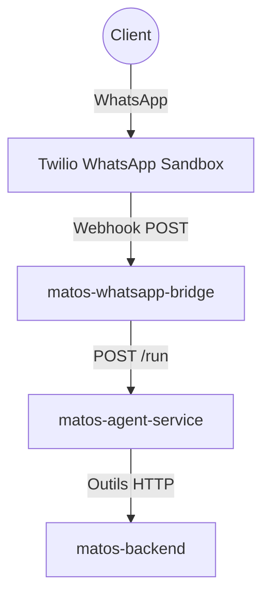

    

# Build with AI: Agent IA pour WhatsApp

Bienvenue dans cet atelier. Ici, l'objectif n'est pas de faire un chatbot de démonstration, mais de construire un agent utile pour un vrai usage business.

En 2 heures, avec du code déjà préparé, vous allez assembler les briques essentielles, lancer les commandes, et obtenir un agent déployé qui peut répondre aux clients sur WhatsApp en s'appuyant sur des données réelles.

## Pourquoi cet atelier existe

Dans beaucoup de petites entreprises, le même problème revient:

- les clients posent les mêmes questions toute la journée,
- les réponses arrivent tard quand l'équipe est occupée,
- les informations produit existent, mais ne sont pas accessibles rapidement dans la conversation.

Cet atelier vous montre comment corriger ce problème avec une architecture simple: un agent qui lit un message, consulte un backend, répond correctement, et signale les intentions d'achat.

## Chatbot vs Agent (version claire)

Un chatbot classique suit surtout des scripts.

Un agent, lui, combine raisonnement + actions:

- il comprend l'intention du client,
- il appelle des outils (APIs) pour lire de vraies données,
- il adapte sa réponse au contexte,
- il peut déclencher une action métier (ex: capture d'un prospect).

Dans ce workshop, vous allez justement construire ce deuxième modèle: un agent qui agit, pas seulement un bot qui répète.

## Ce que vous allez construire

Vous allez déployer trois services sur Google Cloud:

1. `matos-backend`  
    API produits/clients. C'est la source de vérité des données.

2. `matos-agent-service`  
    Le cerveau de l'application. Il interprète le message, appelle les outils backend, puis génère la réponse.

3. `matos-whatsapp-bridge`  
    La passerelle canal. Elle reçoit WhatsApp et transmet au service agent.

## Ce que vous saurez faire à la fin

À la fin de la session, vous aurez:

- un agent déployé sur Cloud Run,
- un flux de test fonctionnel via interface web,
- une intégration WhatsApp prête ou en option selon le temps.

Le plus important: vous comprendrez le schéma de base d'un agent de production réutilisable pour d'autres cas (support, vente, réservation, etc.).

## Format de la session (2 heures)

Le workshop est volontairement guidé et orienté exécution:

- vous copiez/collez les commandes,
- vous complétez quelques TODO ciblés,
- vous validez chaque étape avec un test simple.

Découpage recommandé:

- Setup cloud et variables: 15 min
- Déploiement backend: 15 min
- Construction/test agent: 30 min
- Déploiement agent: 20 min
- Validation finale (web + WhatsApp optionnel): 40 min

## Prérequis minimaux

Il faut seulement:

- des bases Python,
- des bases terminal,
- un compte Google Cloud,
- un navigateur web.

Vous n'avez pas besoin d'être expert DevOps pour suivre.

Passez maintenant à `00 - Variables d'environnement`, puis `01 - Configuration`.

## Architecture utilisée dans cet atelier

### Pourquoi ce flux est recommande

- Le bridge reste simple (transport + sécurité Twilio).
- La logique métier conversationnelle reste dans l'agent.
- Le backend reste réutilisable par d'autres canaux plus tard.

## Objectifs d'apprentissage

- Déployer une architecture AI multi-services sur Cloud Run.
- Gérer des variables d'environnement réutilisables dans Cloud Shell.
- Comprendre comment un agent utilise des outils pour lire des données réelles.
- Intégrer WhatsApp Twilio avec des identifiants sécurisés.

Passez à `00 - Variables d'environnement` puis `01 - Configuration`.
